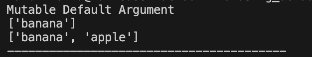
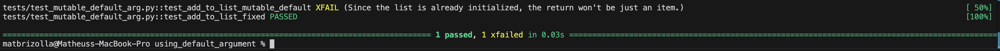

# Mutable Default Arguments

This repository demonstrates the concept of **mutable default arguments** in Python. Mutable default arguments can lead to unintended side effects if not handled correctly. This README explains the issue, provides examples of correct and incorrect implementations, and includes instructions for setting up a virtual environment, running the code, and running unit tests.

## Table of Contents
- [Understanding Mutable Default Arguments](#understanding-mutable-default-arguments)
- [Setup](#setup)
- [Running the Code](#running-the-code)
- [Running Unit Tests](#running-unit-tests)

---

## Understanding Mutable Default Arguments

In Python, using a mutable data type (like lists or dictionaries) as a default argument in a function can lead to unexpected behavior. This is because the default argument is evaluated only once when the function is defined, not each time the function is called. 

### Problem Example

As explained previously, the list/dict is initialized only once when the function is called. This means, the following calls to the function will add the item to the existing list. In the function `add_to_list_mutable_default`, the default list (`list_items`) is shared across all calls to the function:

```python
from typing import List


def add_to_list_mutable_default(item: str, list_items: List[str] = []) -> List[str]:
    list_items.append(item)
    return list_items


print("Mutable Default Argument")
print(add_to_list_mutable_default("banana"))  # ['banana']
print(add_to_list_mutable_default("apple"))  # ['banana', 'apple']
print("-" * 40)
```

**Return:** 

---

## Setup

To isolate dependencies and ensure consistency, you should set up this simple `.venv`. Note: If you already have `pytest` installed, you can skip this section if you want.

**1. Create a virtual environment:**
```bash
python -m venv .venv
```

**2. Activate the virtual environment:**
- On macOS/Linux:
    ```bash
    source .venv/bin/activate
    ```
- On Windows:
    ```cmd
    .venv\Scripts\activate
    ```

**3. Install dependencies (if any are defined in requirements.txt):**
```bash
pip install -r requirements.txt
```

---

## Running the Code

To run the main file simply run the below code after activating the `.venv`.
```bash
python main.py
```

This will produce the following output:
```scss
Mutable Default Argument
['banana']
['banana', 'apple']
----------------------------------------
Fixed Mutable Default Argument
['banana']
['apple']
----------------------------------------
```

---

## Running Unit Tests

These Unit Tests were created to verify the behavior of each function. Next, how to properly run the tests by your own.

**1. Running the Tests:**
```bash
pytest tests/ -v
```

**2. Test Coverage:**
The tests should look like that:

